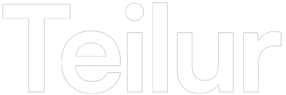

# Teilur AI - Proyecto AI Mental Health

Este proyecto es una aplicación web desarrollada como parte de [Teilur AI](https://www.teilur.ai/), el primer Venture Studio de IA Generativa en Latinoamérica.

## Descripción General

(***Nota: Por favor, añade aquí una descripción más detallada de la funcionalidad específica y el propósito de la aplicación AI Mental Health.***)

Esta aplicación está construida utilizando un stack tecnológico moderno para ofrecer una experiencia de usuario robusta y escalable, integrando posiblemente funcionalidades de IA para abordar aspectos relacionados con la salud mental.

## Tecnologías Utilizadas

*   **Framework Frontend:** [Next.js](https://nextjs.org/) (App Router) - Un framework de React para construir aplicaciones web renderizadas en servidor y estáticas.
*   **Lenguaje:** [TypeScript](https://www.typescriptlang.org/) - Un superset tipado de JavaScript que compila a JavaScript plano.
*   **Estilos:** [Tailwind CSS](https://tailwindcss.com/) - Un framework CSS utility-first para construir rápidamente interfaces de usuario personalizadas.
    *   **Componentes UI:** (Posiblemente [shadcn/ui](https://ui.shadcn.com/) basado en `components.json`) - Componentes UI reutilizables.
*   **ORM:** [Prisma](https://www.prisma.io/) - Un ORM de próxima generación para Node.js y TypeScript. Facilita el trabajo con bases de datos.
*   **Base de Datos:** (***Nota: Especificar la base de datos configurada con Prisma, ej: PostgreSQL, MySQL, SQLite, MongoDB***)
*   **IA / GPTs / APIs:** (***Nota: Detallar aquí los modelos de IA específicos, GPTs, o APIs externas que se estén utilizando y cómo se integran. Ej: OpenAI API, modelos de Hugging Face, etc.***)
*   **Gestor de Paquetes:** [npm](https://www.npmjs.com/)

## Estructura del Proyecto

\`\`\`
.
├── .next/           # Directorio de build de Next.js
├── .vscode/         # Configuración de VSCode
├── node_modules/    # Dependencias del proyecto
├── prisma/          # Esquema y migraciones de Prisma
│   └── schema.prisma
├── public/          # Archivos estáticos
│   └── assets/
│       └── teilur-banner.png # Banner del proyecto
├── src/             # Código fuente de la aplicación Next.js (App Router)
│   ├── app/         # Rutas y componentes de la aplicación
│   ├── components/  # Componentes reutilizables (si aplica)
│   └── lib/         # Utilidades y helpers (si aplica)
├── types/           # Definiciones de tipos TypeScript
├── .gitignore       # Archivos ignorados por Git
├── components.json  # Configuración de componentes (posiblemente shadcn/ui)
├── next.config.js   # Configuración de Next.js
├── package.json     # Metadatos y dependencias del proyecto
├── postcss.config.js # Configuración de PostCSS
├── README.md        # Este archivo
├── tailwind.config.js # Configuración de Tailwind CSS
└── tsconfig.json    # Configuración de TypeScript
\`\`\`

## Instalación y Puesta en Marcha

1.  **Clonar el repositorio:**
    \`\`\`bash
    git clone <URL_DEL_REPOSITORIO>
    cd <NOMBRE_DEL_DIRECTORIO>
    \`\`\`

2.  **Instalar dependencias:**
    \`\`\`bash
    npm install
    \`\`\`

3.  **Configurar variables de entorno:**
    *   Crea un archivo `.env.local` en la raíz del proyecto.
    *   Añade las variables necesarias (ej: `DATABASE_URL` para Prisma, claves de API para servicios de IA, etc.). Consulta `.env.example` si existe.

4.  **Ejecutar migraciones de la base de datos (Prisma):**
    \`\`\`bash
    npx prisma migrate dev
    \`\`\`
    (Opcional) Generar el cliente de Prisma si es necesario:
    \`\`\`bash
    npx prisma generate
    \`\`\`

5.  **Iniciar el servidor de desarrollo:**
    \`\`\`bash
    npm run dev
    \`\`\`

Abre [http://localhost:3000](http://localhost:3000) en tu navegador para ver la aplicación.

## Uso

(***Nota: Añade aquí instrucciones sobre cómo usar las principales características de la aplicación.***)

## Contribuciones

(***Nota: Si deseas aceptar contribuciones, describe aquí el proceso. Ej: Fork, crear rama, hacer commit, Pull Request.***)

## Licencia

Este proyecto está licenciado bajo los términos de la licencia [ISC](LICENSE).

---

© [Teilur, Inc.](https://www.teilur.ai/)